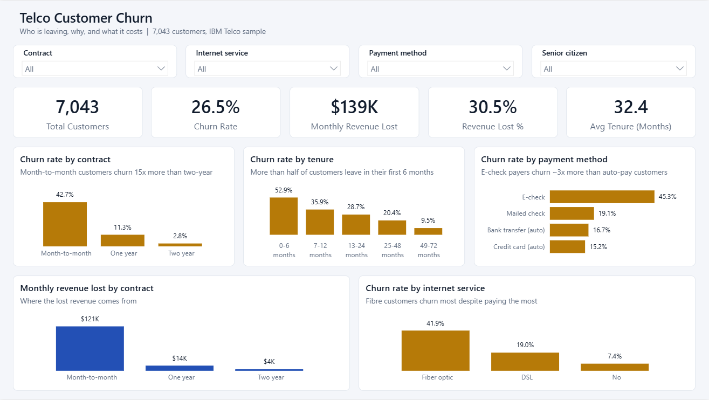
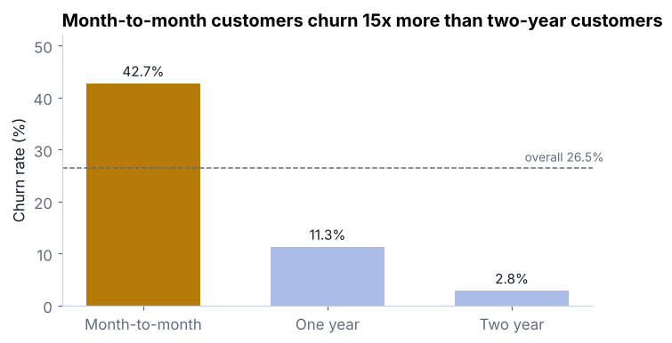
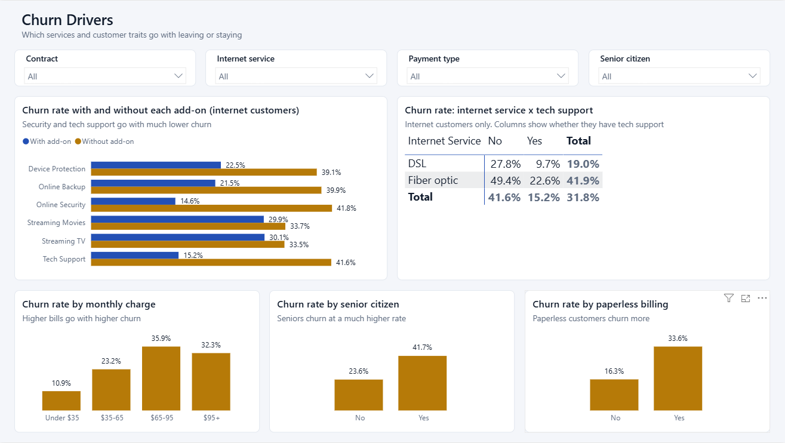
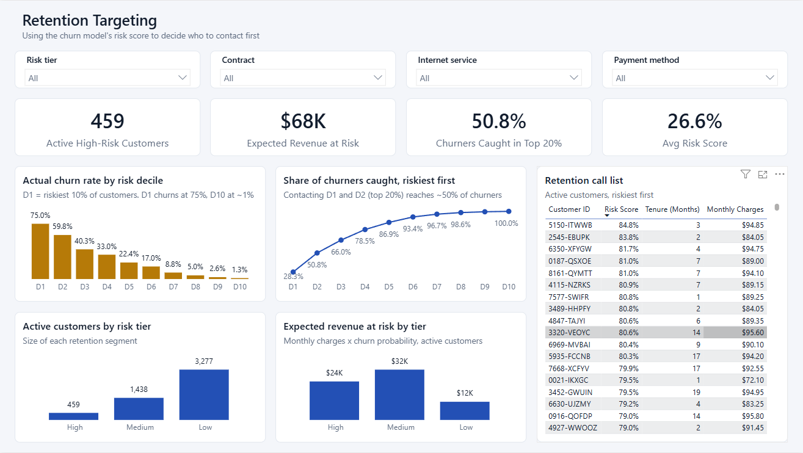
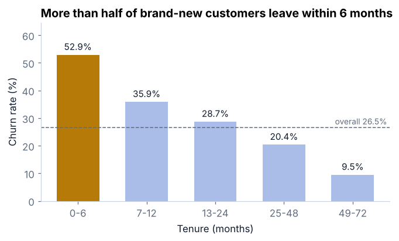
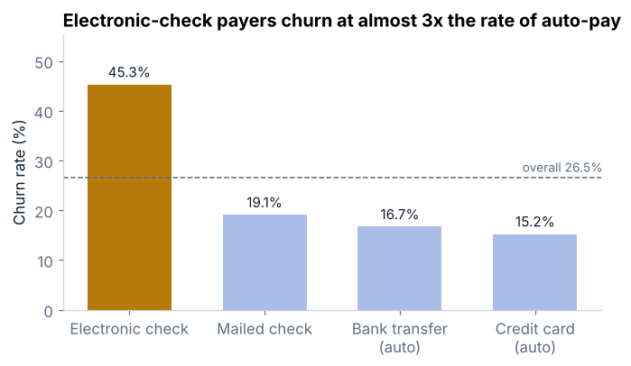
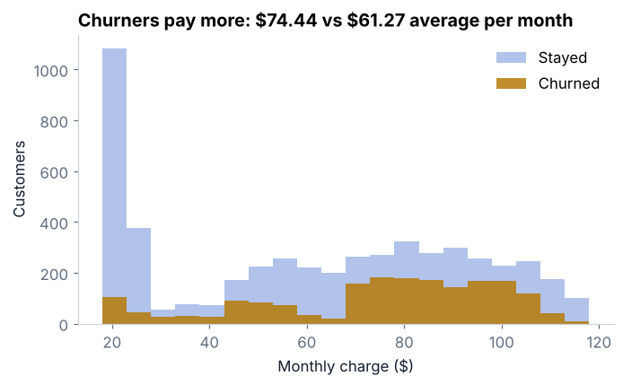
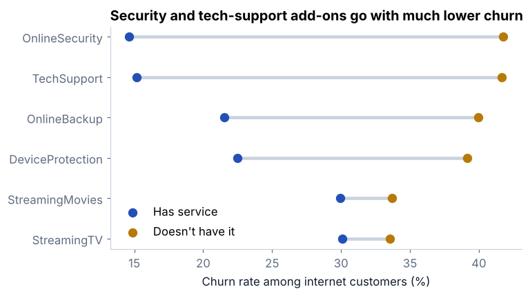
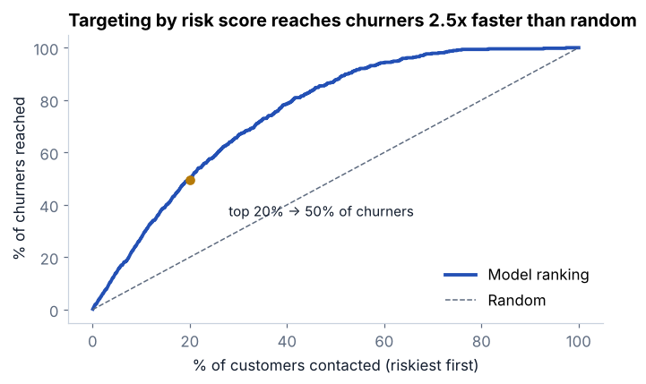
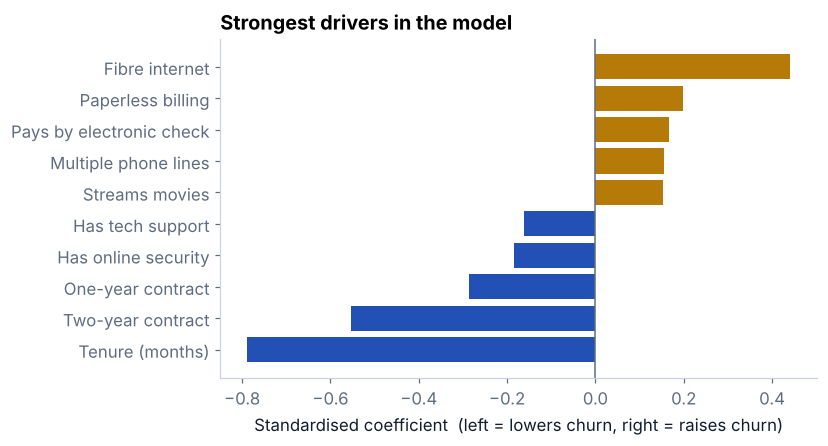

# Telco Customer Churn Analysis

**Who is leaving, why, and what does it cost?** An end-to-end churn analysis of 7,043 telecom customers using SQL, Python, a simple risk model and an interactive Power BI dashboard, ending in concrete retention recommendations.





## Business problem

A telecom company is losing about one in four customers. The retention team has a limited budget and needs to know where to focus. This project answers four questions:

1. How much revenue is churn costing?
2. Which customer groups churn the most?
3. Which services and behaviours go with customers staying?
4. Can we rank customers by risk so the team contacts the right people first?

## Key findings

| | Finding |
|---|---|
| **30.5%** | of monthly revenue is lost to churn: 1,869 of 7,043 customers left, taking **$139k/month** |
| **42.7% vs 2.8%** | churn on month-to-month contracts vs two-year contracts |
| **52.9%** | of customers in their first 6 months churn, falling to 9.5% after 4 years |
| **45.3%** | churn among electronic-check payers vs 15.2–16.7% on automatic payment |
| **49.4% vs 22.6%** | churn among fibre customers without vs with tech support |
| **71.2%** | churn in the highest-risk segment: new, month-to-month, fibre, electronic check (631 customers, $51.9k/month) |
| **50%** | of churners are in the riskiest 20% of customers ranked by the model (ROC-AUC 0.845) |

## Recommendations

- **Push contract upgrades.** Offer a discount or perk for moving from month-to-month to a 1-year contract.
- **Fix onboarding.** Check in with new customers in month 1 and month 3, when churn is highest.
- **Move customers to auto-pay.** Give a small incentive for switching away from electronic check.
- **Bundle protection add-ons.** Include Online Security and Tech Support free for the first 3 months for fibre customers.
- **Use the risk score.** Give the retention team a weekly call list of the highest-risk customers.

## Approach

| Step | What I did |
|---|---|
| **Clean** | Converted `TotalCharges` from text to numbers. Its 11 blanks all had `tenure = 0` (not billed yet), so they were set to 0 rather than dropped. Checked for duplicate IDs and missing values. |
| **SQL** | Loaded the data into SQLite and answered the business questions with `GROUP BY`, `CASE WHEN` bands and conditional aggregation. All queries are in [`sql/churn_queries.sql`](sql/churn_queries.sql). |
| **Explore** | Charted churn by contract, tenure, payment method, monthly charge and add-on services with Matplotlib. |
| **Model** | Logistic regression on one-hot encoded features (75/25 stratified split). `TotalCharges` and `MonthlyCharges` were left out because they duplicate tenure and the services, which made the coefficients misleading. Evaluated with ROC-AUC and a cumulative gains curve. |
| **Dashboard** | Scored every customer with out-of-fold predictions and built a 3-page Power BI report on top (see below). |

## Power BI dashboard

An interactive report for the retention team, saved as a [Power BI Project](https://learn.microsoft.com/power-bi/developer/projects/projects-overview) (`.pbip`), so the data model, DAX and report layout are plain text and can be reviewed in this repo.

| Page | What it answers |
|---|---|
| **Executive Overview** | Headline KPIs (churn rate, monthly revenue lost, share of revenue lost) and churn by contract, tenure, payment method and internet service |
| **Churn Drivers** | Churn with vs without each add-on service, internet service x tech support matrix, and churn by charge band, age and billing type |
| **Retention Targeting** | Risk tiers from the model, actual churn by risk decile, a gains curve, expected revenue at risk, and a call list of active customers ranked by risk |

**How it's built**

- **Scoring:** [`powerbi/scripts/score_customers.py`](powerbi/scripts/score_customers.py) scores each customer with 5-fold out-of-fold predictions (ROC-AUC 0.843), so no customer is scored by a model that trained on them.
- **Power Query:** cleans the data (blank `TotalCharges` → 0), builds tenure, charge and risk bands with sort orders, and unpivots the six add-on services into a separate table.
- **Data model:** `Customers` (one row per customer) → `Add-on Services` (one row per customer per service), plus a dedicated `Churn Measures` table with 19 documented DAX measures in display folders.
- **DAX highlights:** churn and revenue-lost rates, expected revenue at risk (`SUMX` of charge × churn probability), and a cumulative gains curve measure.

**Churn Drivers**



**Retention Targeting**



**To open it:** install [Power BI Desktop](https://www.microsoft.com/power-bi/desktop), open `powerbi/TelcoChurn.pbip`, then click **Refresh**. The data loads from this repo on GitHub; choose *Anonymous* if asked for credentials.

## Charts

| | |
|---|---|
|  |  |
|  |  |
|  |  |

## Repository structure

```
telco-customer-churn-analysis/
├── data/telco_customer_churn.csv   # IBM sample dataset (Apache 2.0)
├── notebooks/churn_analysis.ipynb  # full analysis with outputs
├── sql/churn_queries.sql           # business questions in SQL (SQLite)
├── outputs/                        # charts used in this README
├── powerbi/
│   ├── TelcoChurn.pbip             # open this in Power BI Desktop
│   ├── TelcoChurn.SemanticModel/   # data model, Power Query and DAX (TMDL)
│   ├── TelcoChurn.Report/          # report pages and theme (PBIR)
│   ├── data/customers_scored.csv   # customers with model risk scores
│   ├── scripts/score_customers.py  # produces the scored dataset
│   └── screenshots/
└── requirements.txt
```

## How to run

```bash
git clone https://github.com/Prijesh77/telco-customer-churn-analysis.git
cd telco-customer-churn-analysis
pip install -r requirements.txt
jupyter notebook notebooks/churn_analysis.ipynb
```

## Limitations

The data is a single snapshot, so these results show associations, not proven causes. For example, the contract effect should be confirmed with an A/B test of the upgrade offer before a full rollout.

## Data

[IBM Telco Customer Churn](https://github.com/IBM/telco-customer-churn-on-icp4d) sample dataset, released under the Apache 2.0 licence.

---

**Prijesh Shrestha** · [prijeshshrestha.com.np](https://prijeshshrestha.com.np) · [LinkedIn](https://www.linkedin.com/in/prijeshsth77/)
